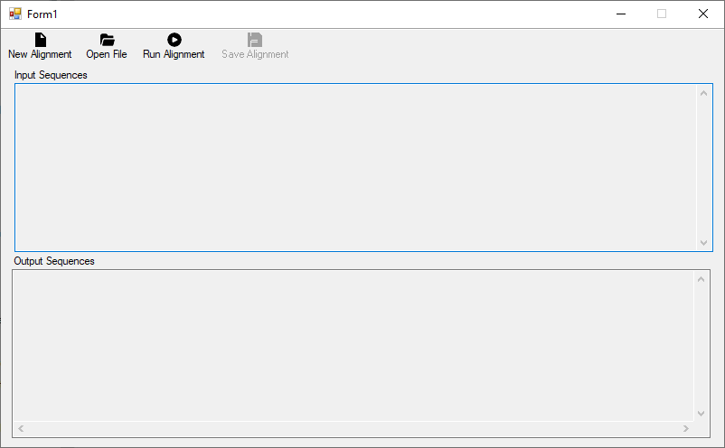

# SIMBA (<ins>S</ins>equence Al<ins>I</ins>gn<ins>M</ins>ent <ins>B</ins>y lion optimization <ins>A</ins>lgorithm)

> Tool for protein multiple sequence alignment based on a parallel hybrid multiobjective lion optimization algorithm method

This project is a ```C#``` implementation of a **parallel hybrid multiobjective lion optimization algorithm** to perform multiple sequence alignment. The project is object-oriented, where the structures of the optimization algorithm are well defined into different classes.

The project provides an user interface, based on Windows Forms. Thus, the ```.sln``` file opens the project with the interface and all algorithm classes. This tool runs exclusively on Windows OS.



## Dependencies

```sh
.NET Framework 4.6.1
```